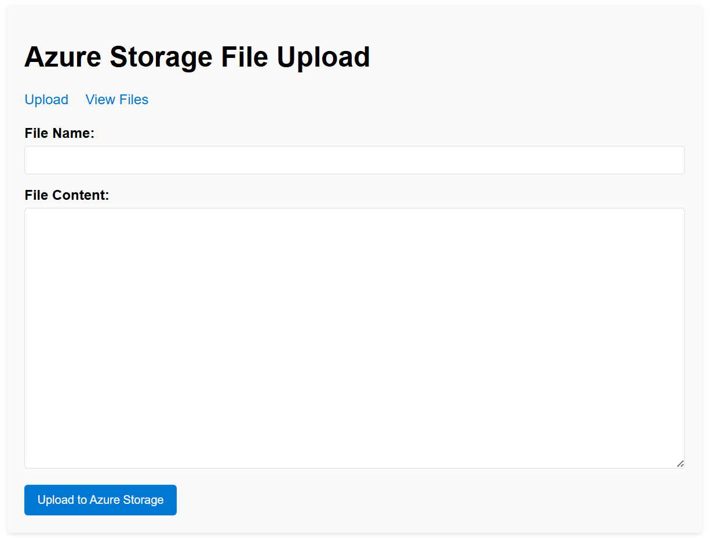

# Flask File Manager - Azure Container Apps

A containerized Flask web application that allows users to upload, list, and view files stored in Azure Blob Storage. The application is designed to run on Azure Container Apps with Managed Identity authentication.



## Architecture

- **Frontend**: Flask web application with HTML templates
- **Storage**: Azure Blob Storage for file storage
- **Authentication**: Azure Managed Identity (no keys required)
- **Hosting**: Azure Container Apps with auto-scaling
- **Infrastructure**: Azure Verified Modules (AVM) for best practices

## Features

- 📁 Upload text files through web interface
- 📋 List all uploaded files
- 👀 View file contents
- 🔒 Secure authentication using Managed Identity
- 🚀 Auto-scaling based on HTTP requests
- 📊 Integrated monitoring and logging

## Local Development

### Prerequisites

- Docker and Docker Compose
- Azure CLI
- Python 3.11+ (optional, for non-Docker development)

### Running with Docker Compose

1. Clone the repository
2. Login to Azure: `az login`
3. Update `docker-compose.yml` with your storage account endpoint
4. Run: `docker-compose up --build`
5. Access the app at http://localhost:8000

### Running without Docker

1. Create virtual environment: `python -m venv venv`
2. Activate: `venv\Scripts\activate` (Windows) or `source venv/bin/activate` (Linux/Mac)
3. Install dependencies: `pip install -r requirements.txt`
4. Set environment variables:
   ```bash
   export AZURE_STORAGE_BLOB_ENDPOINT="https://your-storage.blob.core.windows.net/"
   export AZURE_STORAGE_CONTAINER_NAME="files"
   ```
5. Run: `python app.py`

## Deployment to Azure

### Using Azure Developer CLI (azd)

1. Install [Azure Developer CLI](https://docs.microsoft.com/en-us/azure/developer/azure-developer-cli/install-azd)
2. Login: `azd auth login`
3. Initialize: `azd init` (if not already done)
4. Deploy: `azd up`

This will:
- Build and push the Docker image to Azure Container Registry
- Deploy all Azure resources using Bicep templates
- Configure managed identity and RBAC permissions
- Deploy the container app

### Manual Deployment

1. Build the Docker image:
   ```bash
   docker build -t your-app:latest .
   ```

2. Deploy using Azure CLI or portal with the provided Bicep templates in the `infra/` folder.

## Environment Variables

- `AZURE_STORAGE_BLOB_ENDPOINT`: Your storage account blob endpoint
- `AZURE_STORAGE_CONTAINER_NAME`: Container name for file storage (default: "files")
- `AZURE_CLIENT_ID`: Managed identity client ID (automatically set in Container Apps)
- `PORT`: Application port (default: 8000)
- `FLASK_ENV`: Set to "development" for dev mode
- `FLASK_DEBUG`: Set to "1" for debug mode

## Infrastructure

The application uses Azure Verified Modules (AVM) for infrastructure as code:

- **Container App Environment**: Managed environment for container apps
- **Container App**: The main application with auto-scaling configuration
- **Storage Account**: Blob storage for file persistence
- **Log Analytics**: Centralized logging and monitoring
- **Managed Identity**: Secure, keyless authentication
- **RBAC**: Least-privilege access to storage resources

## Security Features

- 🔐 Managed Identity authentication (no stored credentials)
- 🛡️ Non-root container user
- 🔒 HTTPS-only ingress
- 📊 Comprehensive logging and monitoring
- 🎯 Least-privilege RBAC assignments
- 🚫 No public blob access

## Monitoring

- Application logs are sent to Log Analytics
- Health checks are configured for container health
- Metrics available through Azure Monitor
- Auto-scaling based on HTTP concurrent requests

## Troubleshooting

### Common Issues

1. **Storage access denied**: Ensure managed identity has "Storage Blob Data Contributor" role
2. **Container not starting**: Check logs in Azure portal or use `azd logs`
3. **Build failures**: Ensure Docker is running and .dockerignore is properly configured

### Viewing Logs

```bash
# Using azd
azd logs

# Using Azure CLI
az containerapp logs show --name your-app-name --resource-group your-rg
```

## Contributing

1. Fork the repository
2. Create a feature branch
3. Make changes and test locally with Docker
4. Submit a pull request

## License

MIT License - see LICENSE file for details