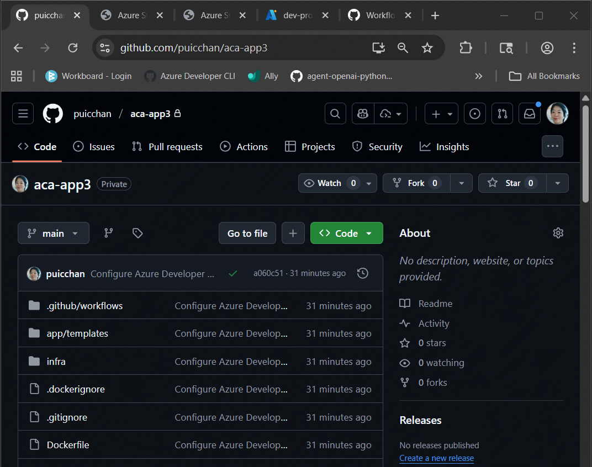

# Azure Developer CLI: Azure Container Apps Dev-to-Prod Deployment with Layered Infrastructure

This post walks through how to implement "build once, deploy everywhere" patterns using Azure Container Apps with the new `azd publish` and layered infrastructure features in Azure Developer CLI v1.20.0. You'll learn how to deploy the same containerized application across multiple environments with proper separation of concerns.

This is the third installment in our Azure Developer CLI series, building on our previous explorations with [Azure App Service and GitHub Actions](https://devblogs.microsoft.com/devops/azure-developer-cli-from-dev-to-prod-with-one-click/) and [Azure DevOps Pipelines](https://devblogs.microsoft.com/devops/azure-developer-cli-from-dev-to-prod-with-azure-devops-pipelines/).

## Build Once, Deploy Everywhere

### The Challenge We're Solving

If you've worked with containers in production, you've probably run into this: `azd deploy` bundles everything together - building your container, pushing to registry, and deploying - all in one go. While this is super convenient for development, it creates some headaches for production scenarios:

- You want to use a **single Azure Container Registry (ACR)** across all your environments
- You need to **build once and deploy everywhere** without rebuilding containers  
- You want **security controls** around which specific container versions get deployed to production
- You need the **flexibility** to deploy the same container with different configurations per environment

### Learning from Our Previous Posts

After writing about dev-to-prod patterns with Azure App Service in our first two blog posts, we realized that Azure Container Apps support in azd had some limitations that prevented teams from implementing the same "build once, deploy everywhere" patterns effectively. The azd team addressed these gaps in the recent releases.

Azure Developer CLI v1.20.0 introduces two capabilities that solve these challenges:

#### 1. **Separated Container Operations**
- **`azd publish`**: Just builds and pushes containers to your registry
- **`azd deploy --from-package`**: Deploys specific container versions to environments (without rebuilding)

#### 2. **Layered Infrastructure (Alpha Feature)**
- Deploy infrastructure in **sequential layers** with proper dependency management
- Share resources like ACR across environments while keeping environment-specific stuff separate
- Outputs from earlier layers automatically become inputs for later layers

I'll show you how this works using a [Flask application example](https://github.com/puicchan/azd-dev-prod-aca-storage) that I migrated from Azure App Service to Azure Container Apps.

## The Sample Application

### What We're Building

The sample application is a simple Flask-based File Manager that demonstrates the key concepts:

- **What it does**: Upload files, list them, and view them - all backed by Azure Blob Storage
- **Security approach**: Uses Azure Managed Identity (no connection strings stored anywhere)

### How the Infrastructure is Organized

Rather than cramming everything into one big template, I've organized this using a layered approach that keeps shared stuff separate from environment-specific resources:

```
┌─────────────────────────────────────────────────────────────────┐
│                     Shared Resources                            │
│  ┌─────────────────────────────────────────────────────────────┐│
│  │ Resource Group: rg-acr-shared                               ││
│  │ ┌─────────────────────────────────────────────────────────┐ ││
│  │ │ Azure Container Registry (Basic SKU)                    │ ││
│  │ │ - Stores container images for all environments          │ ││
│  │ │ - Single source of truth for application containers     │ ││
│  │ └─────────────────────────────────────────────────────────┘ ││
│  └─────────────────────────────────────────────────────────────┘│
└─────────────────────────────────────────────────────────────────┘
┌─────────────────────────────────────────────────────────────────┐
│                   Development Environment                       │
│  ┌─────────────────────────────────────────────────────────────┐│
│  │ Resource Group: rg-dev-environment                          ││
│  │ ┌─────────────────────────────────────────────────────────┐ ││
│  │ │ Container Apps Environment                              │ ││
│  │ │ ┌─────────────────────────────────────────────────────┐ │ ││
│  │ │ │ Container App (Flask Application)                   │ │ ││
│  │ │ │ - Managed Identity for ACR access                   │ │ ││
│  │ │ │ - Auto-scaling enabled                              │ │ ││
│  │ │ └─────────────────────────────────────────────────────┘ │ ││
│  │ └─────────────────────────────────────────────────────────┘ ││
│  │ Azure Storage Account | Key Vault | Application Insights    ││
│  └─────────────────────────────────────────────────────────────┘│
└─────────────────────────────────────────────────────────────────┘
┌─────────────────────────────────────────────────────────────────┐
│                  Production Environment                         │
│  ┌─────────────────────────────────────────────────────────────┐│
│  │ Resource Group: rg-prod-environment                         ││
│  │ ┌─────────────────────────────────────────────────────────┐ ││
│  │ │ Container Apps Environment (VNET-integrated)            │ ││
│  │ │ ┌─────────────────────────────────────────────────────┐ │ ││
│  │ │ │ Container App (Same Image as Dev)                   │ │ ││
│  │ │ │ - Enhanced security configuration                   │ │ ││
│  │ │ │ - Production-grade scaling rules                    │ │ ││
│  │ │ └─────────────────────────────────────────────────────┘ │ ││
│  │ └─────────────────────────────────────────────────────────┘ ││
│  │ VNET | Storage | Key Vault | App Insights | Monitoring      ││
│  └─────────────────────────────────────────────────────────────┘│
└─────────────────────────────────────────────────────────────────┘
```

### Layered Infrastructure Configuration

Here's how the sequence is defined in the `azure.yaml` file:

```yaml
# Azure Container Apps Demo: "Build Once, Deploy Everywhere" with Shared ACR
name: dev-prod

# Layered Infrastructure Deployment Strategy
infra:
  layers:
    # Layer 1: Foundation - Core infrastructure for each environment
    - name: foundation
      path: infra/foundation
    
    # Layer 2: Shared ACR - Single registry for all environments  
    - name: shared-acr
      path: infra/shared-acr
    
    # Layer 3: ACR Role Assignment - Security configuration
    - name: acr-role
      path: infra/acr-role
    
    # Layer 4: Container App - Application deployment
    - name: container-app
      path: infra/container-app

services:
  app:
    project: .
    host: containerapp
    language: python
```

This layered approach solves the classic "chicken-and-egg" problem you run into with container deployments. Here's the thing: both dev and prod need to share the same ACR. Your prod Container App needs permissions to pull from ACR, but you can't assign those permissions until both the Container App identity and the ACR actually exist. By provisioning things in the right sequence, we ensure everything gets the permissions it needs.

Here's how the layers work:
1. **Foundation layer**: Sets up core resources based on your `AZURE_ENV_TYPE` - this includes the Container Apps Environment and Managed Identity
2. **Shared ACR layer**: Creates your centralized container registry (unless you already have one)  
3. **ACR Role Assignment layer**: This is where the magic happens - gives your Managed Identity the right permissions (dev gets push+pull, prod gets pull-only)
4. **Container App layer**: Finally deploys your application, which now has proper ACR access

Each layer outputs the stuff that later layers need - resource IDs, endpoints, you name it - and azd automatically pipes those outputs as inputs to the next layer.

For example, if you peek at `infra/acr-role/main.parameters.json`, you'll see how `AZURE_CONTAINER_REGISTRY_NAME` flows from the shared-acr layer into the ACR role assignment layer:

  ```
      "AZURE_CONTAINER_REGISTRY_NAME": {
      "value": "${AZURE_CONTAINER_REGISTRY_NAME}"` 
  ```

## Try It Out

> ⚠️ **Production Reality Check**  
> While I'm showing you how to deploy locally with `azd up`, **please use CI/CD pipelines for production deployments**. The local workflow I'm demonstrating here is great for rapid prototyping and development, but you'll want proper CI/CD controls for anything that matters.

### Prerequisites

- Azure Developer CLI v1.20.0 or later ([download here](https://aka.ms/azd-install))
- Docker (for local container testing)

### 1. Clone the Sample Repository

```bash
azd init -t https://github.com/puicchan/azd-dev-prod-aca-storage
```

### 2. Set Up Your Development Environment

Development environment setup uses the familiar `azd up` workflow you're probably already comfortable with:

```bash
# Enable alpha feature for layered infrastructure
azd config set alpha.layers on

# Create and configure development environment
azd env new myapp-dev
azd env set AZURE_ENV_TYPE dev

# Deploy everything: infrastructure + build + push + deploy
azd up
```

### 3. Prepare Your Production Infrastructure

Now you'll want to set up your production environment infrastructure. This is typically a one-time thing you do before setting up your CI/CD pipelines:

```bash
# Create production environment
azd env new myapp-prod
azd env set AZURE_ENV_TYPE prod

# Reference existing shared ACR (replace with actual values from dev deployment)
azd env set ACR_RESOURCE_GROUP_NAME rg-shared-acr-resource-group-name
azd env set AZURE_CONTAINER_REGISTRY_ENDPOINT shared-acr-endpoint

# Provision infrastructure only (no build/push/deploy)
azd provision
```

> ⚠️ **Critical Note About Infrastructure**  
> - I'm using `azd provision` locally here to set up the infrastructure BEFORE going live. **In your CI/CD pipelines, you should NEVER run `azd provision`** - stick to `azd deploy` only. Infrastructure changes in production should go through proper approval processes because accidental modifications can cause outages.  
> - When `envType = 'prod'`, the infrastructure automatically includes VNET integration. For demo purposes (easier testing), I've set `internal: false` in `aca-environment.bicep` line 42, so your app stays publicly accessible while the compute is isolated. For truly private environments, you'd flip that to `internal: true` and add a reverse proxy.

### 4. Set Up Your CI/CD Pipeline

Now for the fun part - let's see the pipeline in action! Make a simple code change and commit it.

For example, modify the `<h1>` tag in `index.html`, then run:

```bash
# Select your dev environment and configure pipeline
azd env select myapp-dev
# Make sure you select GitHub as the pipeline provider when prompted
azd pipeline config
```

Here's what to watch for:

1. **GitHub Actions tab**: Head to your repository's Actions tab
2. **Build stage**: Watch the container get built with a unique tag
3. **Dev deployment**: See it automatically deploy to development
4. **Same container everywhere**: Check both environments - they're running the exact same container image

## How the GitHub Actions Workflow Works

The workflow follows a clean three-stage pattern: **Build → Deploy-Dev → Deploy-Prod**

```
┌─────────────────────────────────────────────────────────────────┐
│                        GitHub Actions Workflow                  │
└─────────────────────────────────────────────────────────────────┘

┌─────────────────────────────────────────────────────────────────┐
│ Job 1: BUILD                                                    │
│ ┌─────────────────────────────────────────────────────────────┐ │
│ │ 1. Enable alpha features (layered infrastructure)           │ │
│ │ 2. Set environment names (dev/prod)                         │ │
│ │ 3. Log in with Azure (Federated Credentials)                │ │
│ │ 4. Provision Infrastructure (dev environment)               │ │
│ │ 5. Build & Publish Container to ACR                         │ │
│ │    └─ azd publish app                                       │ │
│ │    └─ Get image: azd env get-value SERVICE_APP_IMAGE_NAME   │ │
│ └─────────────────────────────────────────────────────────────┘ │
│                                                                 │
│ Outputs:                                                        │
│  • container-image: crXXXX.azurecr.io/app:azd-deploy-123456     │
│  • dev-env-name: myapp-dev                                      │
│  • prod-env-name: myapp-prod                                    │
└──────────────────────────────┬──────────────────────────────────┘
                               │
                               ▼
┌─────────────────────────────────────────────────────────────────┐
│ Job 2: DEPLOY-DEV                                               │
│ ┌─────────────────────────────────────────────────────────────┐ │
│ │ 1. Enable alpha features (layered infrastructure)           │ │
│ │ 2. Log in with Azure (Federated Credentials)                │ │
│ │ 3. Deploy to Development                                    │ │
│ │    └─ azd deploy app --from-package <container-image>       │ │
│ │ 4. Validate Application                                     │ │
│ │    └─ Run validation tests, smoke tests                     │ │
│ └─────────────────────────────────────────────────────────────┘ │
└──────────────────────────────┬──────────────────────────────────┘
                               │
                               ▼
┌─────────────────────────────────────────────────────────────────┐
│ Job 3: DEPLOY-PROD                                              │
│ ┌─────────────────────────────────────────────────────────────┐ │
│ │ 1. Enable alpha features (layered infrastructure)           │ │
│ │ 2. Log in with Azure (Federated Credentials)                │ │
│ │ 3. Deploy to Production                                     │ │
│ │    └─ azd deploy app --from-package <same container-image>  │ │
│ │    └─ Uses shared ACR from environment variables            │ │
│ └─────────────────────────────────────────────────────────────┘ │
└─────────────────────────────────────────────────────────────────┘

Key: Same container image (built once) deployed to both environments
```

You can see the complete workflow implementation in the [azure-dev.yml](https://github.com/puicchan/azd-dev-prod-aca-storage/blob/main/.github/workflows/azure-dev.yml) file in the repository.

**The key things to notice:**
- Container gets built **once** in the build stage
- `azd env get-value SERVICE_APP_IMAGE_NAME` grabs the published image name
- Both dev and prod deploy the **exact same container image**
- Validation steps act as quality gates between stages



> **Heads up:** This workflow uses GitHub Actions job outputs to pass the container image name between jobs. That only works on GitHub-hosted runners. If you're using self-hosted runners, you'll need a different approach - maybe store the image name in an artifact or use another method to share data between jobs.

## Wrapping Up

This post walks through how to implement "build once, deploy everywhere" patterns using Azure Container Apps with the new features in Azure Developer CLI v1.20.0. Building on our previous posts about Azure App Service, this Container Apps approach shows how the same core principles work across different Azure compute services.

The combination of layered infrastructure and separated container operations (`azd publish` + `azd deploy --from-package`) gives you a solid foundation when you're ready to move beyond the simplicity of `azd up` but still want to keep that familiar azd developer experience.

**What we covered:**
- **Container Apps integration**: How azd works with Azure Container Apps out of the box
- **Layered infrastructure**: Sequential deployment with proper dependency management
- **Environment separation**: Keep the dev convenience while adding production-ready controls

I realize there are more sophisticated approaches out there depending on what your organization needs. Advanced networking, complex compliance requirements, different deployment strategies - the specific implementation is going to vary based on your team's situation.

We're continuing to explore and validate production deployment scenarios with the Azure Developer CLI, making sure azd provides reliable patterns as your applications grow from development to production.

Questions about the implementation or want to share your own approach? Join the discussion [here](https://github.com/azure/azure-dev/discussions/5447).

*For more Azure Developer CLI content, follow the [Azure Developer CLI blog](https://aka.ms/azd-blog/) and check out the [official documentation](https://aka.ms/azd).*
